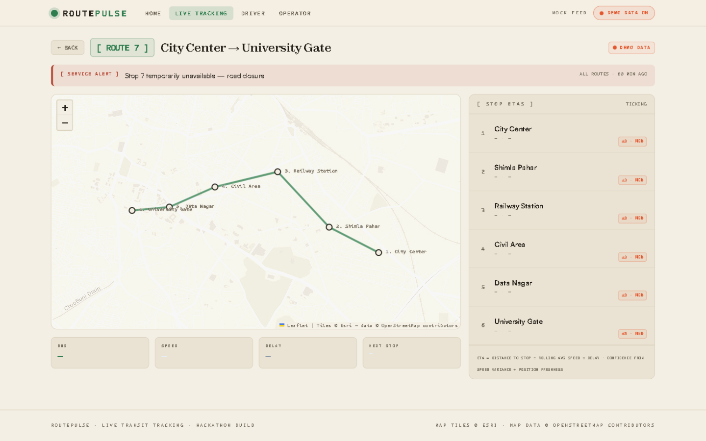
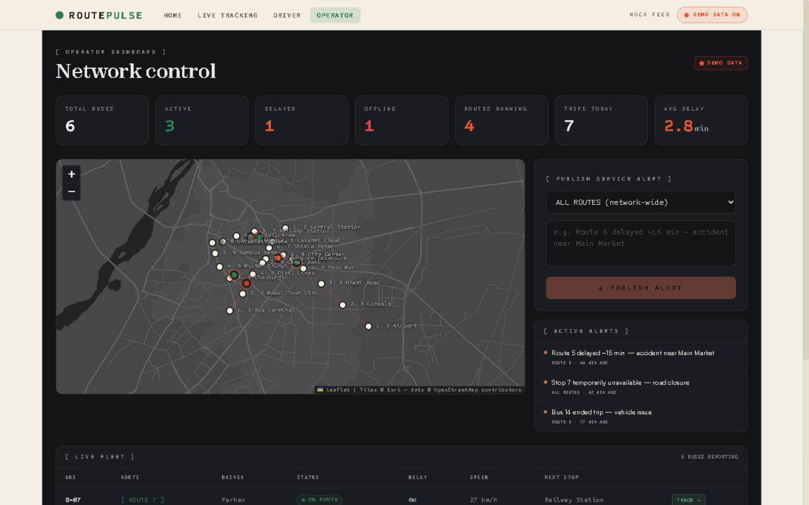

# ROUTEPULSE — The timetable came alive

Live public-transport tracking for Lahore: search a route, watch every bus move on the map in real time, get per-stop arrival **ETAs with a confidence rating**, and receive service alerts the moment operators publish them. Drivers stream phone GPS; operators run the network from a dark control-room dashboard.

https://github.com/HussamHaroon/routepulse/releases/download/demo-v1/demo.mp4

*▶ 71-second narrated demo — operator alert → passenger screen in <2s, live map, confidence-rated ETAs.*



**Passenger (paper register, above)** · **Operator (night register)**



## Try it live (60-second tour)

- **Product video:** the playable demo at the top of this README
- **Live deployment:** https://routepulse-production-50c8.up.railway.app (API + WebSocket + app on one URL)
- **Static demo (offline mock mode):** https://routepulse-pi.vercel.app
- **Operator key** (for driver start-trip / GPS ingest / crowd reports): `routepulse-demo-key`

1. Open [`/#/operator`](https://routepulse-production-50c8.up.railway.app/#/operator) — the night-shift control room: fleet KPIs, live map, active alerts.
2. Open [`/#/track/3`](https://routepulse-production-50c8.up.railway.app/#/track/3) in a second window — buses tick along the corridor every 2 seconds; per-stop ETAs carry confidence ratings.
3. Back in the operator tab, publish a service alert → watch it land on the passenger screen in **under two seconds** over WebSocket.
4. Try [`/#/search`](https://routepulse-production-50c8.up.railway.app/#/search) — direct + transfer results, fares in PKR, favourite routes ★.

## ✨ Novelty highlights

1. **ETAs with a confidence rating.** Every arrival estimate carries `high / medium / low` confidence plus an uncertainty window (`4 min ±1 · high`), computed from speed-sample count, speed variance and position freshness — we show uncertainty instead of hiding it. The system also **self-grades**: predicted vs actual arrivals are logged (`/api/analytics/eta-accuracy` → "80% of ETAs within 2 min, 408 samples").
2. **The two-second alert round trip.** An operator publishes a service alert in the control room → WebSocket `alert` frame → every passenger screen flashes the banner in **under two seconds**, no refresh. A radar ping animation on the map makes the round trip visible.
3. **Boarding alarm.** Pick your stop on any track page, hit **ARM** — when the live ETA crosses 2 minutes the browser fires a real notification ("Your bus is almost here — Data Darbar in ~2 min"). Runs entirely client-side against the ticking ETAs.
4. **Delay-rhythm analytics.** Completed-trip history is mined into per-route verdicts a human operator can act on: *"chronic morning delays — budget +19 min around 07:00"* (`/api/analytics/delay-patterns`).
5. **Dual GPS sources, one endpoint.** The driver console (real phone geolocation) and the built-in simulator POST to the same `/api/ingest/:bus_id` — the path from demo to a real fleet is a config change, not a rewrite.
6. **Crowd reporting.** Passengers report `empty / seats / packed`; the level fans out over WebSocket and feeds route search results.
7. **Living-timetable design system.** Paper register (passengers) vs night register (operators) — one idea, two registers, Clash Display identity, vivid per-route palette, sepia-tinted CARTO basemaps.
8. **Graceful degradation everywhere.** WS drops → polling; backend down → offline demo dataset with an honest badge; boots with trips on missing routes → guarded, never crash-loops.

## Demo (local)

- Local: `npm install` at root, then `npm run dev` → app on :5173, API + GPS simulator on :8787
- The app auto-detects the live feed; if the API is down it switches to an offline demo dataset and says so (badge in the header)

## What's simulated (honesty disclosure)

- Bus positions come from the built-in **GPS simulator** (`simulator/sim.js` + in-process loop) that moves buses along real route polylines — and from the **driver console** using the browser's real geolocation (`/driver` → Enable my GPS). Both feed the same endpoint.
- Seed data is synthetic (Lahore corridors, realistic names/fares). No real passenger data anywhere.

## Architecture

```
app/      Vite + React + Leaflet  ←── WebSocket /ws + REST /api ──→  api/  Express + better-sqlite3 + ws
simulator/ GPS source ──POST /api/ingest/:bus_id──→                                   │
localhost:8787 (single URL: Express serves app/dist + API + WS)            SQLite (auto-seeded)
```

## Novelty — what makes this different

1. **Confidence-rated ETAs.** Every arrival prediction carries a ± window and a `high / medium / low` grade computed from sample count, speed variance and position freshness — passengers see *"4 min ±1 · high"*, not a fake-precise number.
2. **Boarding alarm.** Pick your stop, hit ARM, and the browser notifies you the moment the live ETA crosses 2 minutes. The app doesn't just show the bus — it tells you when to leave.
3. **The two-second round trip.** An operator publishes an alert in the control room; a WebSocket frame lands it on every passenger screen in under two seconds, with a visible radar-ping on the map.
4. **Delay-rhythm analytics.** The API mines completed-trip history into human verdicts — *"chronic morning delays — budget +19 min around 07:00"* — plus an ETA accuracy self-grade (*"80% of ETAs within 2 min, 408 samples"*).
5. **One ingest, two GPS sources.** Phone GPS from the driver console and the fleet simulator feed the same endpoint — swap the sim for a real fleet without touching the app.
6. **Honest degradation.** WebSocket drops → polling takes over; backend dies → the app says so and runs an offline dataset. The demo never shows a blank screen.

- ETA engine: remaining distance along route polyline ÷ rolling average observed speed, adjusted by trip delay; confidence (high/medium/low) from sample count, speed variance and position freshness.
- Transfers: server-side search finds multi-route connections through shared stops.
- Live updates: WebSocket push with automatic polling fallback.

## Screens

| Route | Who | What |
|---|---|---|
| `/#/` | Everyone | The living timetable — stats, story, entry points |
| `/#/search` | Passenger | Route search with direct + transfer results, favourites ★, fares |
| `/#/track/:id` | Passenger | Live map, moving buses, per-stop ETAs with confidence, alerts |
| `/#/driver` | Driver | Start trip, stream GPS, report delays, end trip |
| `/#/operator` | Operator | Fleet KPIs, live map, alert publishing |

## Credits

Media: [Pexels](https://www.pexels.com) (free license) · Basemaps © [CARTO](https://carto.com/basemaps), data © [OpenStreetMap](https://www.openstreetmap.org/copyright) contributors · Fonts: Clash Display & Satoshi via Fontshare (ITF Free Font License), JetBrains Mono via Google Fonts (OFL) · Built at a hackathon in one day by Team Routepulse.
